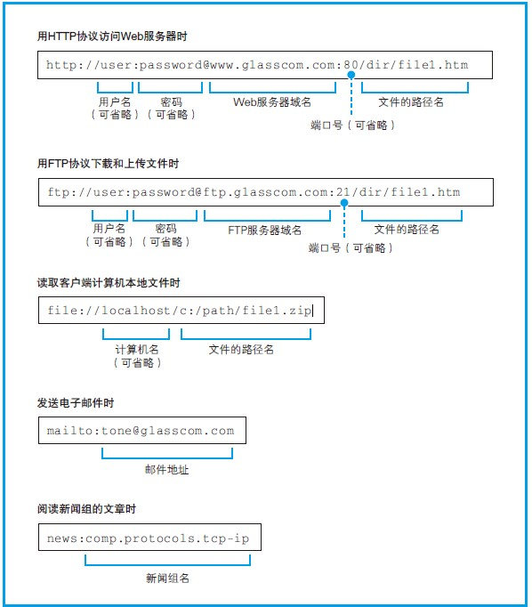
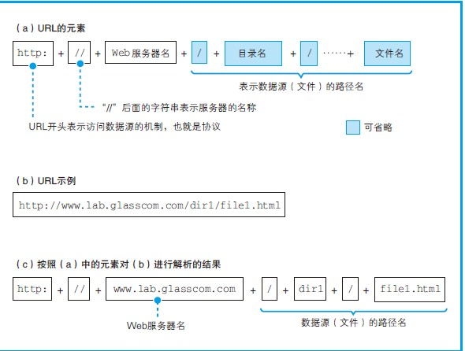
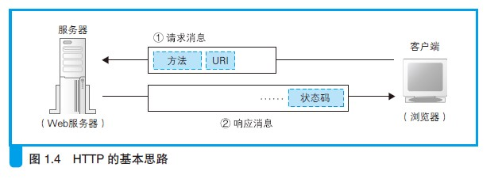
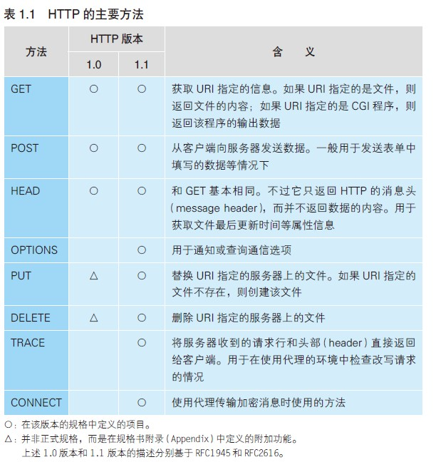

>书籍信息：[网络是怎样连接的]()；[日]户根勤/著 周自恒/译；人民邮电出版社

## 一、读前思考
1. 网络什么样子的，由什么构成的？
2. 服务器在网络中的地位？
3. 如何自建服务器
4. 如何建立一个网站
5. 一些名词的理解

## 二、笔记记录
### 第一章.浏览器生成消息
> * 网址 *（URL）Uniform Resource Locator*，统一资源定位符---就是以*http://* 开头的那一串东西

>*实际上除了“http:”，网址还可以以其他一些文字开头，例如“ftp:”“ file:”“mailto:”C 等。*
> * FTP：File Transfer Protocol，文件传送协议。这是一种在上传、下载文件时使用的协议。使用FTP 协议来传送文件的程序也被叫作FTP。
> *  HTTP：Hypertext Transfer Protocol，超文本传送协议。

>>>>URL 中会包含服务器的域名和要访问的文件的路径名等，而发邮件的URL 则包含收件人的邮件地址。此外，根据需要，URL 中还会包含用户名、密码、服务器端口号A 等信息。  
>>>>>在互联网中常见的几种URL    
>>>>>

浏览器会对URL进行解析，然后向Web服务器发送请求。
>>>

---
* HTTP协议  
>

HTTP 协议定义了客户端和服务器之间交互的消息内容和步骤，其基本思路非常简单。首先，客户端会向服务器发送请求消息（图1.4）。请求消息中包含的内容是“对什么”和“进行怎样的操作”两个部分。  
其中相当于“对什么”的部分称为URI。一般来说，URI 的内容是一个存放网页数据的文件名或者是一个CGI 程序B 的文件名，例如“dir1/file1.html”“/dir1/program1.cgi”等。不过，URI 不仅限于此，也可以直接使用“http:”开头的URL来作为URI。换句话说就是，这里可以写各种访问目标，而这些访问目标统称为URI。  
方法表示需要让Web 服务器完成怎样的工作，其中典型的例子包括读取URI 表示的数据、将客户端输入的数据发送给URI 表示的程序等。  
>

